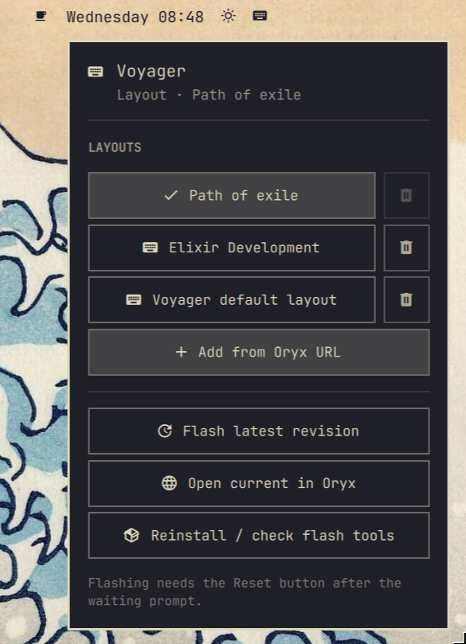

# Omarchy Voyager Layouts

An unofficial [Omarchy](https://omarchy.org/) shell plugin and CLI for switching among saved [Oryx](https://configure.zsa.io/) layout profiles on a [ZSA Voyager](https://www.zsa.io/) keyboard by flashing firmware (via [Zapp](https://github.com/zsa/zapp)).

Use the top-bar keyboard icon (dropdown), the Omarchy menu, optional Hyprland hotkeys, or the `voyager-layout` command.

> **Not the same as** Omarchy’s built-in `omarchy.keyboard-layout` widget, which only cycles **OS / xkb** input languages (US, SE, …). This plugin flashes **keyboard firmware layouts**.

[](https://www.youtube.com/watch?v=If5TmJpFCKQ&autoplay=1)

Full walkthrough: [docs/guide/GUIDE.md](docs/guide/GUIDE.md)  
Developer testing: [docs/guide/TESTING.md](docs/guide/TESTING.md)

---

## Disclaimer — please read

### No affiliation

**This project is an independent, unofficial community work.**

It is **not** created, endorsed, sponsored, affiliated with, or supported by:

- **ZSA Technology Labs** (Voyager, Oryx, Keymapp, Zapp, or any other ZSA product or trademark)
- **Basecamp** / the **Omarchy** project maintainers
- xAI or any other company mentioned only for interoperability

“Voyager”, “Oryx”, “ZSA”, “Keymapp”, “Zapp”, and related names are property of their respective owners and are used here only to describe compatibility.

### Firmware flashing risk

**Flashing firmware can make your keyboard temporarily or permanently unusable, erase or corrupt layouts, require recovery procedures, or cause other hardware or data issues.** USB flashing tools interact with device bootloaders; mistakes, bad cables, power loss, incompatible firmware, interrupted flashes, or software bugs may result in a board that will not enumerate until recovered (or, in rare cases, not at all). Use this software **at your own risk**.

The “AS IS” warranty disclaimer and limitation of liability are in the [MIT License](LICENSE).

---

## Requirements

| Requirement | Notes |
|-------------|--------|
| [Omarchy](https://omarchy.org/) (Arch-based) | Shell plugins via `omarchy plugin add` |
| ZSA Voyager | USB; detected as `3297:1977` (normal) / `3297:0791` (bootloader) |
| One or more **compiled** Oryx layouts | You need shareable layout URLs or `.bin` files |
| **Zapp** (`zsa-zapp` on the AUR) | Required to flash; **not** installed automatically by the plugin adder |
| Optional: `dfu-util` | Fallback flasher if Zapp hits USB errors |

AUR helpers: Omarchy’s `omarchy pkg aur add`, or `yay`.

---

## Install

### 1. Add the plugin

```bash
omarchy plugin add https://github.com/fram74/omarchy-voyager.git --enable
```

Place the widget on the bar if prompted (default: **right**).

Omarchy’s plugin installer **only clones and enables** the plugin. It does **not** install system packages (no sudo / no AUR hooks). That is an Omarchy design constraint, not an oversight in this repo.

### 2. Install flash tools (required once)

Do this from the **top-bar dropdown**, not a command:

1. Plug in the Voyager so the keyboard icon appears.
2. Left-click the icon.
3. Tap **Install flash tools**.

Omarchy cannot install packages when you add a plugin, so the dropdown shows this button until Zapp is present. Layout rows stay dimmed until then. A floating terminal runs the AUR install; a password prompt is normal.

Optional CLI (only if you already use the terminal): `voyager-layout install-deps --with-dfu` — or the copy under `~/.config/omarchy/plugins/net.moggia.voyager-layouts/bin/` if it is not on your PATH.

### 3. Add your layouts

**From the bar (recommended):** plug in the Voyager → click the keyboard icon → **Add from Oryx URL** (at the end of the layout list). A real text field opens in the panel — paste with **Ctrl+V** (or click **Clipboard** after copying the link). Example:

`https://configure.zsa.io/voyager/layouts/xPOwx/latest`

Adding **pins** the compiled firmware: the plugin resolves `/latest` to a specific Oryx revision, downloads that image, and stores its **SHA-256** in `~/.config/omarchy-voyager/layouts.toml`. Flash later uses only that digest — a different file is refused. Config is created if missing. In the panel, use the trash control on a row to **remove** a layout.

From **Super+Space → Voyager → Add from Oryx URL**, the same bar panel opens so you can paste with **Ctrl+V**.

**Or from a terminal:**

```bash
voyager-layout add 'https://configure.zsa.io/voyager/layouts/xPOwx/latest'
# or, after copying the URL:
voyager-layout add --clipboard
```

**Or edit the TOML by hand** (custom names, local `.bin` files):

```bash
mkdir -p ~/.config/omarchy-voyager
cp ~/.config/omarchy/plugins/net.moggia.voyager-layouts/config/layouts.toml.example \
   ~/.config/omarchy-voyager/layouts.toml
```

```toml
[settings]
default = "daily"
notify = true

[[layouts]]
id = "daily"
name = "Daily"
oryx = "https://configure.zsa.io/voyager/layouts/YOUR_ID/latest"
```

Then pin (downloads the compiled image and records `revision` + `sha256`):

```bash
voyager-layout pin daily
# or, if you already know the digest:
voyager-layout pin daily --sha256 0123456789abcdef0123456789abcdef0123456789abcdef0123456789abcdef
```

Local firmware file instead of (or as well as) an Oryx URL. Pin hashes the file:

```toml
file = "/home/YOU/.local/share/voyager/gaming.bin"
```

### 4. Optional: CLI on your PATH

```bash
ln -sfn ~/.config/omarchy/plugins/net.moggia.voyager-layouts/bin/voyager-layout ~/.local/bin/voyager-layout
ln -sfn ~/.config/omarchy/plugins/net.moggia.voyager-layouts/bin/voyager-layout ~/.local/bin/voyager-layouts
```

The CLI name is **`voyager-layout`**. `voyager-layouts` is the same binary (the plugin id is plural).

### 5. Optional: Omarchy menu entries

Merge the keys from  
`~/.config/omarchy/plugins/net.moggia.voyager-layouts/menu/voyager-menu.jsonc`  
into `~/.config/omarchy/extensions/omarchy-menu.jsonc` (or run `./scripts/install.sh` from a git checkout, which can help with a fresh setup).

### 6. Optional: Hyprland hotkeys

See `hypr/bindings.lua.snippet`. Append the bindings you want into `~/.config/hypr/bindings.lua`. Suggested defaults:

| Shortcut | Action |
|----------|--------|
| `Super+Shift+V` | Layout picker, then flash |
| `Super+Shift+U` | Re-pin the current layout to Oryx latest, verify SHA-256, then flash |

Hotkeys **stage** a flash; you still must press **Reset** when prompted.

---

## Using the bar

1. Plug in the Voyager. The keyboard icon appears on the top bar (hidden when unplugged).
2. Left-click → dropdown under the icon (same pattern as Bluetooth / Power).
3. Choose a layout → a floating terminal runs the flash.
4. When you see **Waiting for keyboard in bootloader mode…**, press the Voyager **Reset** button **once** (top edge near the `3` key on the default layout, or a Reset key you mapped in Oryx).
5. Do **not** press Reset during download, and do **not** start a flash while the board is already in bootloader mode—unplug/replug first so keys work normally.

Other panel actions:

- **Re-pin & flash latest** — re-pin the current layout to Oryx’s latest compiled revision, store the new SHA-256, then flash that verified file  
- **Open current in Oryx** — opens the layout URL in your browser  
- **Install flash tools** / **Reinstall / check flash tools** — user-initiated AUR install  

---

## Flashing procedure (important)

Wrong timing is the most common cause of `USB transfer error: hardware fault or protocol violation`.

1. Voyager in **normal** mode (keys type). If unsure: unplug USB → wait 5s → plug **directly** into the laptop (no hub/dock), both halves joined with the TRRS cable.
2. Start flash (bar or CLI).
3. Wait for: `Waiting for keyboard in bootloader mode...`
4. Press **Reset once**.
5. Wait until the process finishes before unplugging.

Keep at least one known-good pinned layout in your config so you can recover if a flash goes wrong.

### Firmware pinning

Oryx `/latest` is mutable: a later compile can change the bytes behind the same URL. This plugin **does not flash `/latest`**. `add` and `pin` snapshot a specific revision and the SHA-256 of that file into `layouts.toml`. `flash` then:

1. Downloads that **pinned revision** (or uses a local `file =`)
2. Refuses to continue unless the SHA-256 matches the stored digest
3. Passes only that verified local file to Zapp / `dfu-util`

`flash --latest` (the bar’s **Re-pin & flash latest** button) is the explicit way to take a **new** snapshot, record the new digest, and flash it. Pass `--sha256` to `add` / `pin` if you already know the digest and want the download rejected on mismatch.

If you already have a `layouts.toml` from plugin 0.1.x, run `voyager-layout pin --all` once before flashing.

---

## CLI reference

```bash
voyager-layout status              # USB mode, current layout, whether Zapp is installed
voyager-layout list                # Configured layouts (unpinned ones are marked)
voyager-layout add <oryx-url>      # Add + pin firmware (name from Oryx title)
voyager-layout add <oryx-url> --sha256 <hex>  # Add only if the download matches
voyager-layout pin <id>            # Snapshot latest compiled revision + sha256
voyager-layout pin --all           # Pin every layout in the config
voyager-layout remove <id>         # Remove a layout from the config
voyager-layout sync-names          # Refresh names from Oryx titles
voyager-layout flash <id>          # Flash the pinned, verified image (then Reset)
voyager-layout flash --latest      # Re-pin current layout to Oryx latest, then flash
voyager-layout flash <id> --method dfu-util   # Fallback flasher
voyager-layout open [id]           # Open layout in Oryx
voyager-layout pick                # Omarchy menu picker, then flash
voyager-layout install-deps        # Install Zapp (AUR)
voyager-layout install-deps --with-dfu -y
```

Config path: `~/.config/omarchy-voyager/layouts.toml`  
State (last flashed id): `~/.local/state/omarchy-voyager/current`

---

## Troubleshooting

| Symptom | What to try |
|---------|-------------|
| No bar icon | Plug in the Voyager; wait a few seconds; `omarchy restart shell` |
| Click does nothing / no dropdown | `omarchy restart shell` (rescan alone does not reload bar QML) |
| “zapp not found” | Bar icon → **Install flash tools** (CLI: `voyager-layout install-deps`) |
| `hardware fault or protocol violation` | Unplug/replug to normal mode; direct USB port; Reset only after the waiting line; or `--method dfu-util` |
| Flash starts with no waiting line | Board was already in bootloader — unplug/replug, then flash again |
| Layout URL errors | Compile the layout in Oryx first, then `voyager-layout add` or `pin` |
| `not pinned (missing sha256)` | Layout was added by hand without a digest — run `voyager-layout pin <id>` |
| `firmware digest mismatch` | File or Oryx image changed since it was pinned; re-pin only if you intended a new snapshot |
| Want to uninstall | See [Remove](#remove) |

Official ZSA flashing docs (for comparison / recovery): [zsa.io/flash](https://zsa.io/flash). This project does not replace Keymapp or ZSA support.

---

## Remove

Disable and uninstall the shell plugin:

```sh
omarchy plugin disable net.moggia.voyager-layouts
omarchy plugin remove net.moggia.voyager-layouts
```

That removes the checkout under `~/.config/omarchy/plugins/net.moggia.voyager-layouts/` and takes the widget off the bar.

Optional cleanup (not deleted by `plugin remove`):

```sh
# Layout list and last-flashed state
rm -rf ~/.config/omarchy-voyager ~/.local/state/omarchy-voyager

# CLI symlink, if you created one
rm -f ~/.local/bin/voyager-layout ~/.local/bin/voyager-layouts
```

Flash tools installed via **Install flash tools** / `voyager-layout install-deps` (`zsa-zapp`, optional `dfu-util`) stay on the system until you uninstall them with your package manager (for example `yay -Rns zsa-zapp`).

If you merged Voyager entries into `~/.config/omarchy/extensions/omarchy-menu.jsonc` or added hotkeys from `hypr/bindings.lua.snippet`, remove those by hand.

---

## Developer / local checkout

Work from an existing checkout of this repository. Do not fetch remote HEAD and run the installer in one step — `./scripts/install.sh` only links **this** checkout.

```bash
./scripts/install.sh
voyager-layout install-deps --with-dfu
omarchy plugin validate .
```

How to validate, hot-reload, run CLI tests, and click through the live shell: **[docs/guide/TESTING.md](docs/guide/TESTING.md)**.

Repo layout:

```text
manifest.json              # Required at git root for omarchy plugin add
BarWidget.qml / Panel.qml
bin/voyager-layout
config/layouts.toml.example
docs/guide/                # User GUIDE.md + TESTING.md
menu/  hypr/  scripts/  tests/
```

---

## License

Distributed under the [MIT License](LICENSE).

**Trademarks and products of ZSA Technology Labs, Basecamp, and others remain their property. This software is unofficial and unsupported by those parties. Use at your own risk.**
