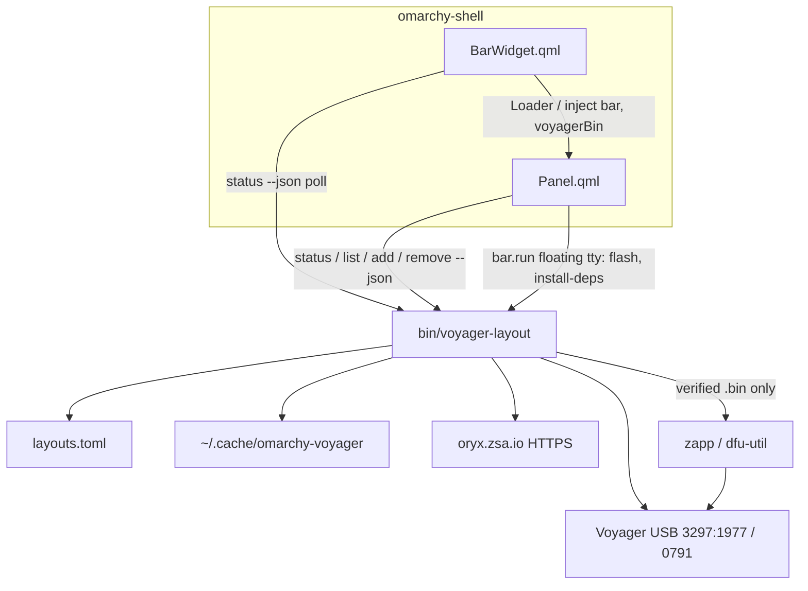

# How this Omarchy plugin is put together

Technical overview of **Omarchy’s plugin contract** and how **Voyager Layouts** (`net.moggia.voyager-layouts`) uses it. User walkthrough: [../guide/GUIDE.md](../guide/GUIDE.md). How to test: [../guide/TESTING.md](../guide/TESTING.md).

This plugin is Voyager-only (USB IDs and Oryx `/voyager/` URLs). Zapp supports other ZSA boards; this checkout does not.

---

## Omarchy plugin architecture

An Omarchy (Quattro) plugin is an **unsandboxed QML package** loaded by the long-lived **Quickshell** process (`omarchy-shell`). It is a **public git repository** with `manifest.json` at the **repo root** (no nested `plugin/` directory).

```text
omarchy plugin add <git-url> --enable
        │
        ▼
~/.config/omarchy/plugins/<manifest.id>/     # git clone of the repo
        │
        ▼
omarchy-shell  ── PluginRegistry ── reads manifest.json
               ── shell.json      ── enabledPlugins[] / bar.widgets[]
               ── Loader          ── entryPoints.<kind> QML
               ── IpcHandler      ── omarchy-shell -q <id> <fn>
```

`omarchy plugin add` **only** clones, validates the manifest, and toggles enablement. It does **not** run install hooks, `sudo`, or AUR. System packages (here: Zapp) must be installed by a **user-initiated** action after add.

### Manifest contract

`schemaVersion` must be `1`. `id` must not use the reserved `omarchy.*` prefix. Entry points are **relative** paths: no `..`, no absolute paths, **no symlinks inside** the plugin folder (`omarchy plugin validate` and load-time checks). Linking the **whole checkout** to `~/.config/omarchy/plugins/<id>/` is allowed for local development.

### Kinds

A plugin declares one or more `kinds`. Each kind needs a matching `entryPoints` file.

| Kind | Role |
|------|------|
| `bar-widget` | Chip in a bar section; may own a popout panel |
| `panel` | Persistent or summoned floating window |
| `overlay` | Fullscreen surface (pickers, etc.) |
| `menu` | Summoned menu surface |
| `service` | Headless singleton, typically at startup |
| `bar` | Replaces the built-in bar |

**This plugin declares only `bar-widget`.** `Panel.qml` is loaded by the widget as a popout; it is not a separate plugin kind.

### Activation and IPC

- `activation: "on-demand"` (this plugin) vs keep-loaded services/panels.
- Bar widgets exist whenever they are placed on the bar. Popout QML is created when first opened.
- Plugins expose functions through Quickshell `IpcHandler`. Callers use:

  ```bash
  omarchy-shell -q net.moggia.voyager-layouts addUrl
  omarchy-shell -q net.moggia.voyager-layouts toggle
  ```

### What is not in the plugin model

- No sandbox and no OS permission manifest beyond what you document.
- No package install on `plugin add`.
- No first-party test runner for third-party QML — only `omarchy plugin validate` plus a live session.
- Marketplace “Verified” is a scan of an **exact git SHA**. `omarchy plugin add` still clones mutable `main` HEAD unless Omarchy grows a pin.

### Optional, outside `kinds`

| Piece | Where |
|-------|--------|
| Super+Space menu | Merge keys into `~/.config/omarchy/extensions/omarchy-menu.jsonc` |
| Hyprland binds | User copies a snippet (this repo: `hypr/bindings.lua.snippet`) |
| `shell.json` | Records which widgets are on which bar section |

---

## This plugin’s layout on disk

```text
plugin checkout  (~/.config/omarchy/plugins/net.moggia.voyager-layouts/)
  manifest.json                 # contract
  BarWidget.qml                 # only declared entry point
  Panel.qml                     # dropdown; not a kind
  bin/voyager-layout            # USB, Oryx, pin, flash
  config/layouts.toml.example
  scripts/install.sh            # local symlink install (not marketplace add)
  menu/voyager-menu.jsonc
  hypr/bindings.lua.snippet
  docs/

user state (not in the plugin tree)
  ~/.config/omarchy-voyager/layouts.toml     # lockfile: revision + sha256
  ~/.local/state/omarchy-voyager/current     # last flashed layout id
  ~/.cache/omarchy-voyager/<id>-<rev>.bin    # pinned firmware cache
```

**Why QML and a CLI:** Quickshell has no first-class USB or Oryx client. The widget is chrome. Hashing, HTTPS caps, AUR, and `dfu-util` live in one Python program so they can be unit-tested without the desktop.

---

## Component roles



| Component | Job |
|-----------|-----|
| `manifest.json` | Id `net.moggia.voyager-layouts`, kind `bar-widget`, default bar section **right** |
| `BarWidget.qml` | Icon, visibility, poll, popout host |
| `Panel.qml` | Dropdown UI + IPC + CLI invocations |
| `bin/voyager-layout` | Detect board, pin firmware, verify digest, flash |
| `layouts.toml` | User lockfile; flash refuses missing/mismatched `sha256` |
| Zapp (AUR `zsa-zapp`) | Writes the **local** `.bin` to the board |
| `dfu-util` | Optional fallback at Ignition address `0x08002000` |

---

## Bar widget runtime

`BarWidget.qml` extends Omarchy’s `BarWidget` (`qs.Ui`) with `moduleName: "net.moggia.voyager-layouts"`.

1. **`pluginRoot`** from `Qt.resolvedUrl(".")` so `bin/voyager-layout` works for both `omarchy plugin add` and a whole-tree symlink.
2. **Poll** `voyager-layout status --json` — every **3s** when disconnected, **15s** when connected — so the icon appears soon after plug-in.
3. **`visible`** only if USB mode is `normal` or `bootloader` (Voyager PIDs `3297:1977` / `1978` and `0791` / `1791`). Unplugged → the bar slot **hides**.
4. **Click** loads `Panel.qml` and injects `bar`, `settings`, `anchorItem`, `hostWidget`, `voyagerBin`.
5. Implements the shell popout contract (`opened`, `open` / `close`, `closeForPopoutSwitch`) so it behaves like Bluetooth / Power.

---

## Dropdown panel runtime

`Panel.qml` is a `Panel` with `ipcTarget: "net.moggia.voyager-layouts"`.

**In-process `Process` (argv array, JSON on stdout):**

| UI | CLI |
|----|-----|
| Header / connection | `status --json` |
| Layout rows | `list --json` |
| Add URL / clipboard | `add … --json` |
| Trash | `remove <id> --json` |

Progress logs go to **stderr** so JSON parse on stdout does not break.

**Floating terminal** (`bar.run` + `omarchy-launch-floating-terminal-with-presentation`) for work that needs a TTY or a password:

- `flash <id>`
- `flash --latest` (re-pin, then flash)
- `install-deps --with-dfu -y`

If Zapp is missing, layout rows stay dimmed and the panel shows **Install flash tools**.

**IPC** (`IpcHandler`): `open`, `close`, `show`, `hide`, `toggle`, `addUrl`.

---

## CLI: pin then flash

Marketplace review cares about this path. `/latest` is only resolved at **pin** time. **Flash** uses a stored revision + SHA-256.

```text
add / pin                            flash
────────                             ─────
HTTPS to oryx.zsa.io only            require revision + sha256 in toml
  Content-Length / chunked cap       cache <id>-<rev>.bin or re-download
  firmware max 512 KiB               sha256 must match; else refuse
  JSON / GraphQL max 64 KiB          zapp flash /path/to.bin
  resolve /latest → revision         optional dfu-util
  download firmware/{rev}
  write revision + sha256 to toml
```

**USB:** `lsusb` for Voyager PIDs only.

**Oryx allowlist:** `https://oryx.zsa.io/firmware/…` and `/graphql`. Redirects off that host are refused. Unbounded `response.read()` is not used.

Example lockfile after pin:

```toml
[[layouts]]
id = "daily"
name = "Elixir Development"
oryx = "https://configure.zsa.io/voyager/layouts/4RbWm/Oavj3r"
revision = "Oavj3r"
sha256 = "fd658d6629357a1e8d70cfe22b6a0b804c3890a44a03b910be947a99dc716293"
```

---

## End-to-end flash

```text
User clicks a layout row
  → Panel.flashLayout(id)
  → floating terminal: voyager-layout flash daily
      Voyager must be in normal mode (keys work)
      verified_firmware_file()     # digest or die
      zapp flash ~/.cache/…/4RbWm-Oavj3r.bin
      user presses Reset after "Waiting for bootloader"
      write ~/.local/state/omarchy-voyager/current
  → bar timer: status --json → icon / header
```

---

## Two install paths

| Path | What happens |
|------|----------------|
| `omarchy plugin add <git> --enable` | Clone to `plugins/<id>/`, put the widget on the bar (default **right**). Does **not** install Zapp. |
| Bar **Install flash tools** | User-initiated `install-deps` → `omarchy pkg aur add zsa-zapp` (or `yay`). |
| `./scripts/install.sh` | Developer: symlink **this** checkout to `plugins/<id>/` and `~/.local/bin`. |

QML under `plugins/` often hot-reloads. A stuck bar widget usually needs `omarchy restart shell` (`rescanPlugins` does not always reload bar QML).

---

## Design split

| Layer | Owns |
|-------|------|
| Omarchy shell | Discovery, bar chrome, popouts, IPC, `shell.json` |
| This QML | Poll, dropdown, launching the CLI |
| `voyager-layout` | Integrity of firmware (pin, cap, digest) and talking to Zapp |

The shell never sees raw Oryx bytes. The CLI never draws UI. That is the whole architecture.
